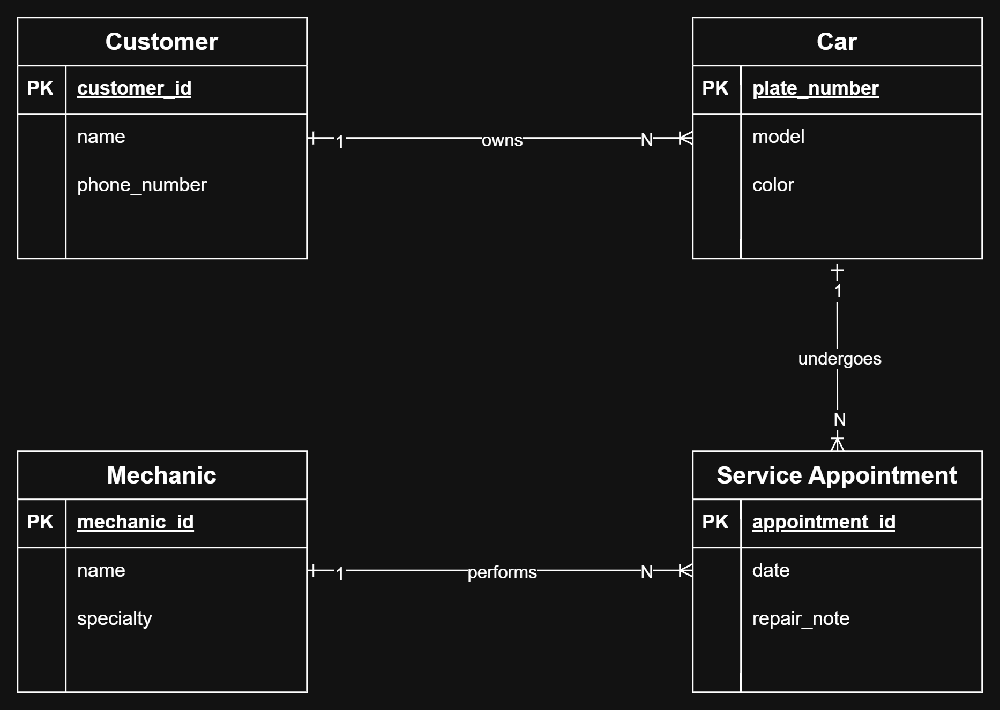

# INFOMAN1 – Week 2 Lab: Conceptual ERD Case Study
**Name:** Stephanie Mhay D. de Leon  
**Student ID:** 2510576  
**Section:** BSIT-II

## Task 1 — Candidate Entities

| Entity | Justification |
|---|---|
| Customer | The scenario states "the shop has many customers" and "each customer may bring in one or more cars," making Customer a distinct entity with its own identity, not a descriptor of another entity. |
| Car | The scenario states "each car has a model, a plate number, and a color," giving Car its own attributes and identity, separate from the customer it belongs to. |
| Mechanic | The scenario states "the shop employs several mechanics, each with a name and a specialty," making Mechanic a distinct entity that persists independently of any single car or appointment. |
| Service Appointment | The scenario states "each service appointment has a date and a short repair note," giving it its own identity and attributes rather than being a property of Car or Mechanic. |

## Task 2 — Attributes per Entity

### Customer
- Primary Key: customer_id
- Attributes:
  - customer_id — Domain: numeric integer, auto-generated
  - name — Domain: text string
  - phone_number — Domain: text string, valid phone format (7-15 character)

### Car
- Primary Key: plate_number
- Attributes:
  - plate_number — Domain: text string, alphanumeric string (e.g. 'XYZ-5467')
  - model — Domain: text string(e.g 'Adventure')
  - color — Domain: text string

### Mechanic
- Primary Key: mechanic_id
- Attributes:
  - mechanic_id — Domain: numeric integer
  - name — Domain: text string
  - specialty — Domain: text string (e.g. 'brake', 'engine')

### Service Appointment
- Primary Key: appointment_id
- Attributes:
  - appointment_id — Domain: numeric, auto-generated
  - date — Domain: date (YYYY-MM-DD)
  - repair_note — Domain: text string

## Task 3 — Relationships

| Relationship (verb phrase) | Between | Cardinality | Checked both directions? |
|---|---|---|---|
| owns | Customer ↔ Car | 1:N | Yes — one customer may bring in one or more cars, but each car belongs to exactly one customer. |
| undergoes | Car ↔ Service Appointment | 1:N | Yes — one car may be serviced across many visits over time, but each appointment refers to exactly one car. |
| performs | Mechanic ↔ Service Appointment | 1:N | Yes — one mechanic may work on many appointments over time, but each appointment has exactly one mechanic assigned. |

## Task 4 — Conceptual ERD

