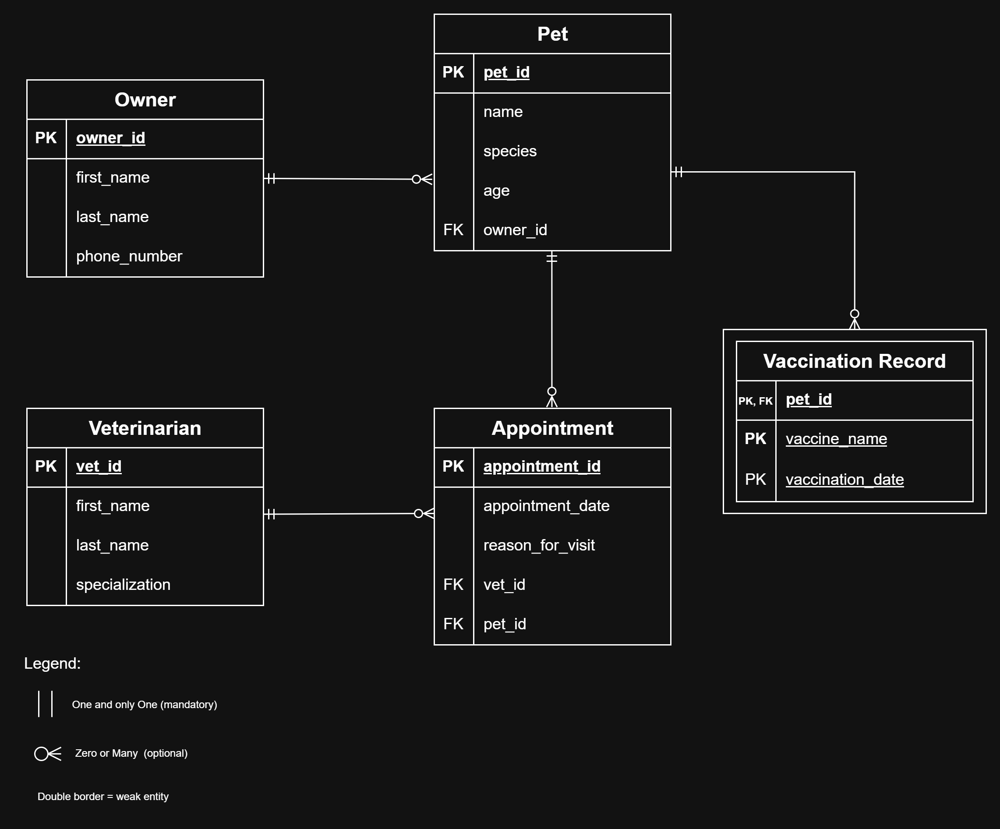

# INFOMAN1 — Week 3 Lab Answers

## Task 1 — Classify Attributes and Identify Weak Entities

| Attribute(s) | Justification | Classification |
|---|---|---|
| `full_name` (Owner and Veterinarian) | Splits into atomic parts, `first_name` and `last_name`, which become separate columns. | Composite |
| `vaccination history` | A pet can have zero, one, or many vaccinations, so it cannot fit in a single column. It is resolved into its own entity, `vaccination_record`. | Multivalued |
| `owner_id`, `phone_number`, `pet_id`, `name`, `species`, `age`, `appointment_id`, `appointment_date`, `reason_for_visit`, `vet_id`, `specialization`, `vaccine_name`, `vaccination_date` | Single-valued, indivisible values. | Simple / Atomic |
| None | Nothing is computed from another stored value (`age` is stored directly). | Derived |

**Weak entity determination.** `Vaccination Record` is a weak entity. By definition, a weak entity has no key of its own and cannot exist without an owner (strong) entity, connected by an identifying relationship. Vaccination Record meets both parts:
- `vaccine_name` and `vaccination_date` are not unique on their own (two pets can get the same vaccine on the same day), so they are only a **partial key**.
- The scenario says a record "cannot be uniquely identified or looked up on its own" and only makes sense for its pet, so it depends on `Pet`.

Its primary key is therefore `(pet_id, vaccine_name, vaccination_date)`: the parent key plus the partial key.

## Task 2 — Specify Cardinality & Participation

Outer symbol = cardinality (`|` one, `<` many). Inner symbol = participation (`|` mandatory, `O` optional).

| Between | Relationship | Scenario evidence (both directions) | Symbols |
|---|---|---|---|
| Owner ↔ Pet | owns | "every pet must belong to exactly one owner" gives one, mandatory at Owner. An owner "is not required to have any pets on file" gives many, optional at Pet. | Owner `\|\|` — Pet `O<` |
| Pet ↔ Appointment | schedules | "exactly one veterinarian and exactly one pet — an appointment cannot exist without both" gives one, mandatory at Pet. Nothing requires a pet to have appointments, so many, optional at Appointment. | Pet `\|\|` — Appointment `O<` |
| Veterinarian ↔ Appointment | conducts | The same "exactly one veterinarian" clause gives one, mandatory at Veterinarian. A vet "can conduct multiple appointments over time or none at all" gives many, optional at Appointment. | Veterinarian `\|\|` — Appointment `O<` |
| Pet ↔ Vaccination Record (identifying) | receives | Each record "only makes sense in relation to the specific pet it belongs to" gives one, mandatory at Pet. "a pet may have zero, one, or several vaccination records" gives many, optional at Vaccination Record. | Pet `\|\|` — Vaccination Record `O<` |

## Task 3 — Build the Logical ERD

- **Weak entity:** `Vaccination Record` has a double border. Its primary key combines the parent key `pet_id` (PK, FK) with the partial key `vaccine_name` and `vaccination_date`.
- **Multivalued attribute:** vaccination history is resolved into the `Vaccination Record` entity above.
- **Many-to-many:** Veterinarian ↔ Pet (a vet sees many pets, and a pet sees many vets) is resolved by the junction entity `Appointment`, which holds `vet_id` and `pet_id` as foreign keys.
- **Composite attribute:** each `full_name` is split into `first_name` and `last_name`.

## Task 4 — Translate to Relational Schema Notation

Primary keys are <ins>underlined</ins>; foreign keys are labeled FK.

`owner` ( <ins>`owner_id`</ins>, `first_name`, `last_name`, `phone_number` )

`veterinarian` ( <ins>`vet_id`</ins>, `first_name`, `last_name`, `specialization` )

`pet` ( <ins>`pet_id`</ins>, `name`, `species`, `age`, `owner_id` FK )
*Note: `owner_id` references `owner(owner_id)`*

`appointment` ( <ins>`appointment_id`</ins>, `appointment_date`, `reason_for_visit`, `vet_id` FK, `pet_id` FK )
*Note: `vet_id` references `veterinarian(vet_id)`*
*Note: `pet_id` references `pet(pet_id)`*

`vaccination_record` ( <ins>`pet_id`</ins> FK, <ins>`vaccine_name`</ins>, <ins>`vaccination_date`</ins> )
*Note: `pet_id` references `pet(pet_id)`*
*Note: primary key is composite ( `pet_id`, `vaccine_name`, `vaccination_date` )*

## Task 5 — Key Justification & Schema Validation

### Key Justifications

**`pet` — surrogate key.** `pet_id` is a clinic-assigned ID. `name`, `species`, and `age` are not unique or stable (two cats can both be named "Milo"), so a surrogate key is the safe identifier and gives `appointment` and `vaccination_record` a stable foreign key. `owner_id` and `vet_id` follow the same reasoning, since names and phone numbers can repeat or change.

**`vaccination_record` — natural composite key.** `(pet_id, vaccine_name, vaccination_date)` is used because the entity is weak. Its identity comes from its pet, and a pet does not get the same vaccine twice on the same day. A surrogate ID would hide the weak-entity dependency.

### Schema Validation

| Status | Schema Representation | Scenario Requirement Statement |
|---|---|---|
| Verified | `owner(owner_id, first_name, last_name, phone_number)` | "A pet owner, identified by an owner ID, full name (first name, last name), and phone number..." |
| Verified | `owner` has no required link to `pet`, so an owner can have 0 pets | "...not required to have any pets on file..." |
| Verified | `pet.owner_id` is a NOT NULL foreign key | "...every pet must belong to exactly one owner." |
| Verified | `pet(pet_id, name, species, age)` | "A pet has a pet ID, name, species, and age." |
| Verified | `appointment(appointment_id, appointment_date, reason_for_visit)` | "Every appointment tracks an appointment ID, date, and reason for visit..." |
| Verified | `appointment.vet_id` and `appointment.pet_id` are NOT NULL foreign keys | "...must specify exactly one veterinarian and exactly one pet..." |
| Verified | `veterinarian(vet_id, first_name, last_name, specialization)` | "A veterinarian, identified by vet ID, full name, and specialization..." |
| Verified | No required link from `veterinarian` to `appointment`; a vet can have 0..N | "...can conduct multiple appointments over time or none at all." |
| Verified | `vaccination_record(pet_id, vaccine_name, vaccination_date)` | "...vaccination history (vaccine name, vaccination date)..." |
| Verified | No required link from `pet` to `vaccination_record`; a pet can have 0..N | "...zero, one, or several vaccination records" |
| Verified | Weak entity: composite PK includes the parent key `pet_id` | "...cannot be uniquely identified or looked up on its own." |

## Self-Check

- [ ] All tasks committed with individual, meaningful commit messages
- [ ] All files placed inside `week3/`
- [ ] This file completed `answers.md`
- [ ] Repository link pasted into Moodle (no files uploaded)