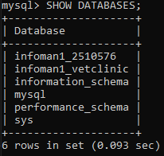
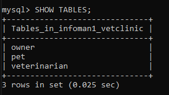
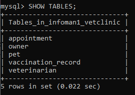
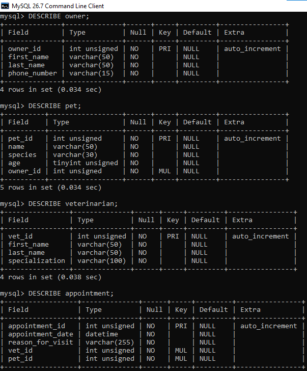
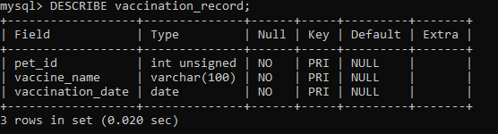
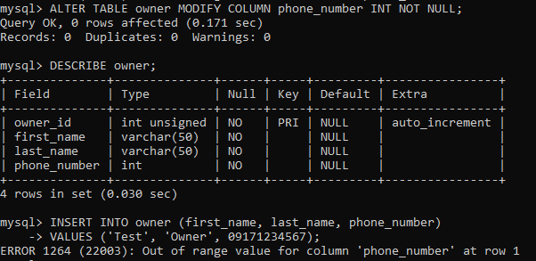
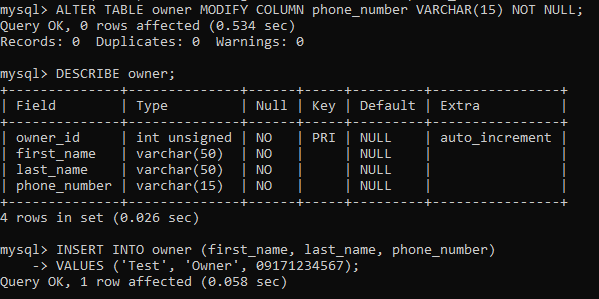

# INFOMAN1 — Week 4 Lab Answers
**SQL 1: DDL & Table Creation** | Database: `infoman1_vetclinic`

Script: [`vetclinic.sql`](vetclinic.sql) | Screenshots: [`screenshots/`](screenshots/)

This lab implements the Week 3 relational schema in MySQL:

```
owner ( owner_id, first_name, last_name, phone_number )
veterinarian ( vet_id, first_name, last_name, specialization )
pet ( pet_id, name, species, age, owner_id FK )
appointment ( appointment_id, appointment_date, reason_for_visit, vet_id FK, pet_id FK )
vaccination_record ( pet_id FK, vaccine_name, vaccination_date )   -- composite PK
```

---

## Task 1 — Create the Database

```sql
CREATE DATABASE infoman1_vetclinic;
SHOW DATABASES;
USE infoman1_vetclinic;
```



**Result:** `infoman1_vetclinic` now appears in the `SHOW DATABASES;` output.

---

## Task 2 — Core Tables

```sql
CREATE TABLE owner (
    owner_id      INT UNSIGNED AUTO_INCREMENT,
    first_name    VARCHAR(50) NOT NULL,
    last_name     VARCHAR(50) NOT NULL,
    phone_number  VARCHAR(15) NOT NULL,
    PRIMARY KEY (owner_id)
);

CREATE TABLE veterinarian (
    vet_id          INT UNSIGNED AUTO_INCREMENT,
    first_name      VARCHAR(50)  NOT NULL,
    last_name       VARCHAR(50)  NOT NULL,
    specialization  VARCHAR(100) NOT NULL,
    PRIMARY KEY (vet_id)
);

CREATE TABLE pet (
    pet_id    INT UNSIGNED AUTO_INCREMENT,
    name      VARCHAR(50)  NOT NULL,
    species   VARCHAR(30)  NOT NULL,
    age       TINYINT UNSIGNED NOT NULL,
    owner_id  INT UNSIGNED NOT NULL,
    PRIMARY KEY (pet_id),
    CONSTRAINT fk_pet_owner
        FOREIGN KEY (owner_id) REFERENCES owner (owner_id)
);
```



**Data type choices**

| Column | Type | Reason |
|---|---|---|
| `owner_id`, `vet_id`, `pet_id` | `INT UNSIGNED AUTO_INCREMENT` | Whole-number IDs that are never negative. MySQL numbers them automatically. |
| `first_name`, `last_name`, `name` | `VARCHAR(50)` | Variable-length text. |
| `phone_number` | `VARCHAR(15)` | An identifier, not a quantity. Text keeps the leading 0 and "+63". |
| `specialization` | `VARCHAR(100)` | Free text that can be longer. |
| `species` | `VARCHAR(30)` | Short text such as "Dog" or "Cat". |
| `age` | `TINYINT UNSIGNED` | Small whole number of years (0–255) that is never negative. |
| `pet.owner_id` | `INT UNSIGNED NOT NULL` | Must match `owner.owner_id`. `NOT NULL` because every pet belongs to exactly one owner. |

**Primary keys:** `owner_id` (owner), `vet_id` (veterinarian), `pet_id` (pet).

---

## Task 3 — Relationship Tables

```sql
CREATE TABLE appointment (
    appointment_id    INT UNSIGNED AUTO_INCREMENT,
    appointment_date  DATETIME     NOT NULL,
    reason_for_visit  VARCHAR(255) NOT NULL,
    vet_id            INT UNSIGNED NOT NULL,
    pet_id            INT UNSIGNED NOT NULL,
    PRIMARY KEY (appointment_id),
    CONSTRAINT fk_appointment_vet
        FOREIGN KEY (vet_id) REFERENCES veterinarian (vet_id),
    CONSTRAINT fk_appointment_pet
        FOREIGN KEY (pet_id) REFERENCES pet (pet_id)
);

CREATE TABLE vaccination_record (
    pet_id            INT UNSIGNED NOT NULL,
    vaccine_name      VARCHAR(100) NOT NULL,
    vaccination_date  DATE         NOT NULL,
    PRIMARY KEY (pet_id, vaccine_name, vaccination_date),
    CONSTRAINT fk_vaccination_pet
        FOREIGN KEY (pet_id) REFERENCES pet (pet_id)
);
```



| Table | Foreign key | References |
|---|---|---|
| `appointment` | `vet_id` | `veterinarian(vet_id)` |
| `appointment` | `pet_id` | `pet(pet_id)` |
| `vaccination_record` | `pet_id` | `pet(pet_id)` |

- `appointment` resolves the Veterinarian–Pet many-to-many relationship. Both foreign keys are `NOT NULL` because every appointment needs exactly one vet and exactly one pet.
- `vaccination_record` is the weak entity. Its composite primary key is the parent key `pet_id` plus the partial key `vaccine_name` and `vaccination_date`. `pet_id` is also a foreign key to `pet`.

---

## Task 4 — Verify the Schema

`SHOW TABLES;` lists all five tables: `appointment`, `owner`, `pet`, `vaccination_record`, `veterinarian` (see the Task 3 screenshot above).

### DESCRIBE output





**owner**

| Field | Type | Null | Key | Extra |
|---|---|---|---|---|
| owner_id | int unsigned | NO | PRI | auto_increment |
| first_name | varchar(50) | NO | | |
| last_name | varchar(50) | NO | | |
| phone_number | varchar(15) | NO | | |

**pet**

| Field | Type | Null | Key | Extra |
|---|---|---|---|---|
| pet_id | int unsigned | NO | PRI | auto_increment |
| name | varchar(50) | NO | | |
| species | varchar(30) | NO | | |
| age | tinyint unsigned | NO | | |
| owner_id | int unsigned | NO | MUL | |

**veterinarian**

| Field | Type | Null | Key | Extra |
|---|---|---|---|---|
| vet_id | int unsigned | NO | PRI | auto_increment |
| first_name | varchar(50) | NO | | |
| last_name | varchar(50) | NO | | |
| specialization | varchar(100) | NO | | |

**appointment**

| Field | Type | Null | Key | Extra |
|---|---|---|---|---|
| appointment_id | int unsigned | NO | PRI | auto_increment |
| appointment_date | datetime | NO | | |
| reason_for_visit | varchar(255) | NO | | |
| vet_id | int unsigned | NO | MUL | |
| pet_id | int unsigned | NO | MUL | |

**vaccination_record**

| Field | Type | Null | Key | Extra |
|---|---|---|---|---|
| pet_id | int unsigned | NO | PRI | |
| vaccine_name | varchar(100) | NO | PRI | |
| vaccination_date | date | NO | PRI | |


## Task 5 — Fix a Deliberate Mistake

### The mistake

`owner.phone_number` was deliberately changed from `VARCHAR(15)` to `INT`:

```sql
ALTER TABLE owner MODIFY COLUMN phone_number INT NOT NULL;
DESCRIBE owner;
```

### How DESCRIBE revealed it



The `Type` column for `phone_number` changed from `varchar(15)` to `int`. A phone number is an identifier, not a quantity used in arithmetic, so `INT` is the wrong type:

- `INT` tops out at 2,147,483,647, so a real mobile number such as 09171234567 does not fit. The test `INSERT` failed with **ERROR 1264 (22003): Out of range value for column 'phone_number'**.
- Numbers stored as `INT` lose a leading 0 and cannot hold a "+63" prefix.

### The correction

```sql
ALTER TABLE owner MODIFY COLUMN phone_number VARCHAR(15) NOT NULL;
DESCRIBE owner;
```



After the fix, `DESCRIBE owner;` shows `phone_number` as `varchar(15)` again, and the same `INSERT` that failed before now succeeds (`Query OK, 1 row affected`).

**Corrected column definition:**

```sql
phone_number VARCHAR(15) NOT NULL
```
